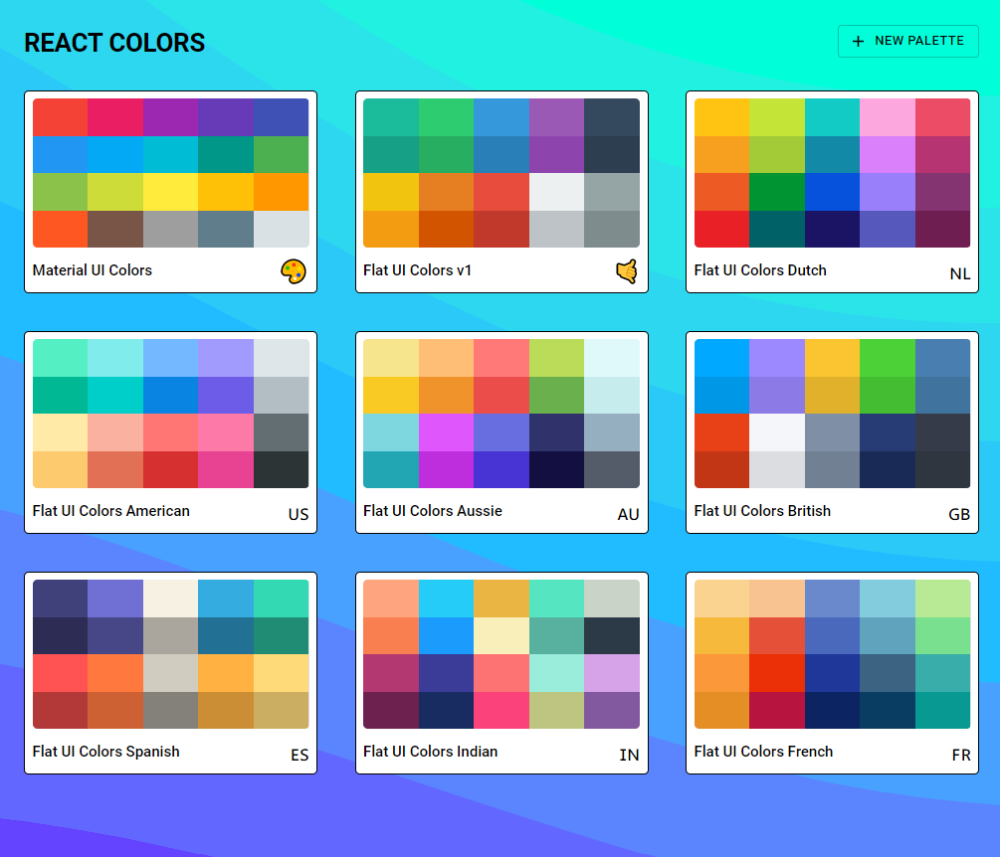

# 🌈 react-color-palette

> A color palette picker inspired by [flatuicolor](https://flatuicolors.com/) built with React & material UI

&nbsp;

  

<!-- ## Features
- **Higher Order Components** – Integrates with your existing components
- **Drag handle, auto-scrolling, locked axis, events, and more!**
- **Create and save your own custom palettes** – WIP -->
&nbsp;

## Installation

    $ git clone https://github.com/Asifm95/react-color-palette.git
    $ cd react-color-palette
    $ npm install

## Start & watch

    $ npm start

Open [http://localhost:3000](http://localhost:3000) to view it in the browser.

## Simple build for production

    $ npm run build
